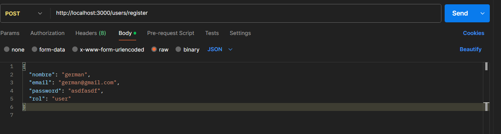
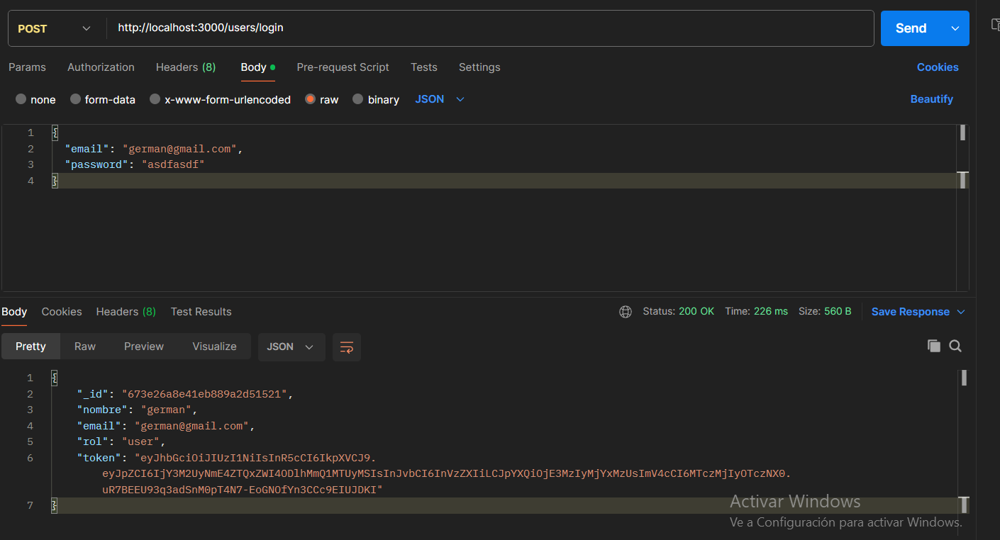
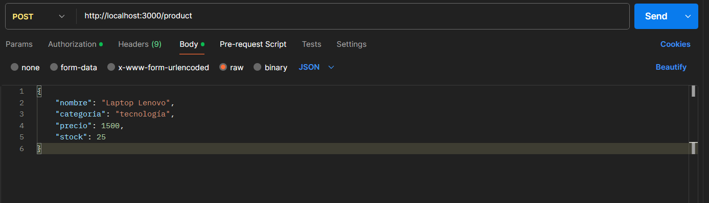
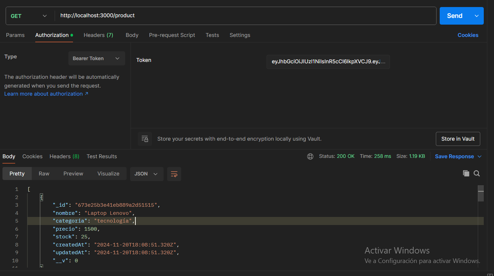
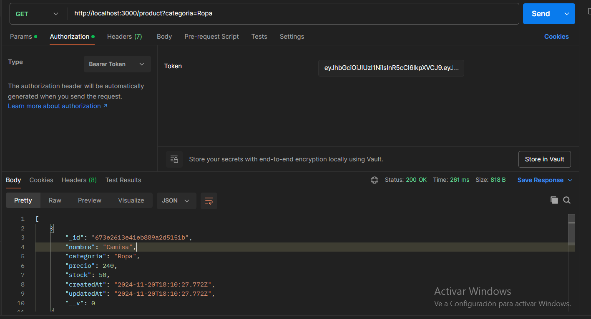
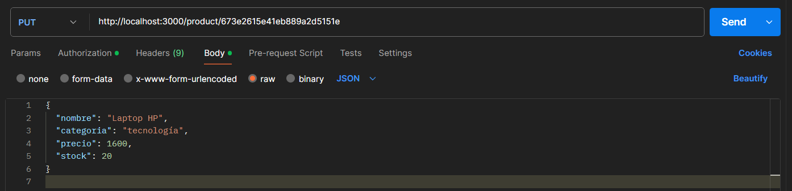
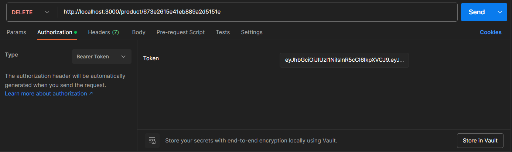

Como usar este proyecto

Pasos:

1.- Installar las dependencias: npm install 
2.- Correr el proyecto: node server.js
3.- utilizar postman
-----------------------------------------------------------------------------------------------------------------------------
    metodo POST:
        register:  http://localhost:3000/users/register
                        
                opciones:     Body -> raw -> JSON:
                    {
                    "nombre": "german",
                    "email": "german@gmail.com",
                    "password": "asdfasdf",
                    "rol": "user"
                    }
                

        **********************************************************************************************
        login:  http://localhost:3000/users/login
                    
        opciones:     Body -> raw -> JSON:
                {
                "email": "german@gmail.com",
                "password": "asdfasdf"
                }   
        - obtenemos el token y Copiamos 

        
        **********************************************************************************************

        Añadir un nuevo producto solo usuarios (ADMIN): http://localhost:3000/product

            opciones: - autorization -> bearToken -> pegamos el token copiado en el login
                        Click en Send y nos retorna todos los productos de la base de dato de la categoria requerida    
                      - Body -> raw -> JSON:
        
-----------------------------------------------------------------------------------------------------------------------------        
    Metodo GET: 
        Obtener poductos: http://localhost:3000/product

        opciones: autorization -> bearToken -> pegamos el token copiado en el login
        Click en Send y nos retorna todos los productos de la base de dato
        
        **********************************************************************************************
        Obtener poductos por categoria: http://localhost:3000/product?categoria=Ropa

        opciones: autorization -> bearToken -> pegamos el token copiado en el login
        Click en Send y nos retorna todos los productos de la base de dato de la categoria requerida
        
----------------------------------------------------------------------------------------------------------------------------       
    metodo PUT Solo usuarios (ADMIN):
        Editar un producto:  http://localhost:3000/product/673e2615e41eb889a2d5151e

                nota: Colocar el ID del producto a Editar   

                opciones: - autorization -> bearToken -> pegamos el token copiado en el login
                            Click en Send y nos retorna todos los productos de la base de dato de la categoria requerida     
                          - Body -> raw -> JSON:
                    {
                    "nombre": "Laptop HP",
                    "categoria": "tecnología",
                    "precio": 1600,
                    "stock": 20
                    }
               

-----------------------------------------------------------------------------------------------------------------------------
        metodo DELETE Solo usuarios (ADMIN):

        Editar un producto:  http://localhost:3000/product/673e2615e41eb889a2d5151e
                nota: Colocar el ID del producto a eliminar       
                opciones: - autorization -> bearToken -> pegamos el token copiado en el login
                            Click en Send y nos retorna todos los productos de la base de dato de la categoria requerida     
                          - Body -> raw -> JSON:
                    {
                    "nombre": "Laptop HP",
                    "categoria": "tecnología",
                    "precio": 1600,
                    "stock": 20
                    }
                